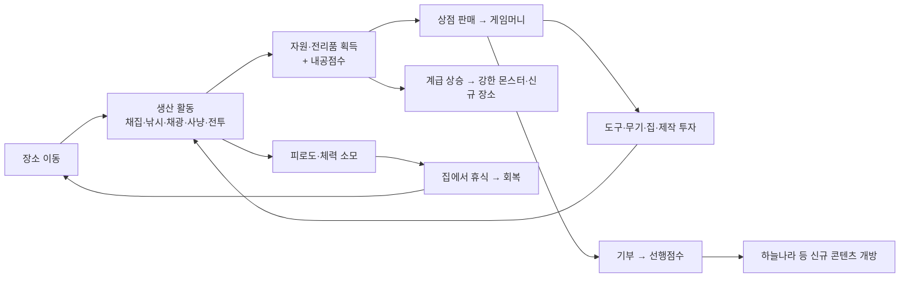

# 🏘️ 키즈짱 시장놀이 — 전체 리메이크 개발 계획서 (v1)

> 목적: 추억의 **다음 키즈짱 「시장놀이」(원제 조이월드, by 엔토로, 2007~2015)** 를
> 웹 기반으로 되살리기 위한 **전체 스코프** 개발 계획.
> 이 문서는 초안(v1)이며, 작성자(AI)의 1차 자체 검토를 포함합니다.
> 이후 사용자 검토·수정 → 확정 → 구현 순서로 진행합니다.

---

## 0. 문서 사용법

- **1~9장**: 게임 설계 & 개발 계획 (제안)
- **10장**: 작성자(AI) 1차 자체 검토 — 강점 / 리스크 / 결정 필요 사항
- **11장**: ✅ 사용자 검토 확정 결과(v2) 및 구현 현황

## ✅ v2 확정 요약 (사용자 검토 완료)

| 결정 | 내용 |
|---|---|
| 실행 방식 | **모듈 분리 + GitHub Pages 정적 호스팅** |
| 멀티플레이 | **제외** |
| 유료 재화 | **별머니(인게임 획득 전용, 현금결제 없음)** 로 대체 |
| 아트 | **SVG/이미지를 외부 AI로 생성 투입** (에셋 파이프라인 구축됨) |
| 범위/순서 | **전 단계(P1~P5) 전부 구현**, 순서는 작성자 재량 |
| 밸런스 | **중간** 성향 |
| 언어 | **한국어** |

→ 이 기준으로 **P1(기반정비) 완료**. 상세는 11장 참고.

---

## 1. 게임 개요 (Overview)

| 항목 | 내용 |
|---|---|
| 제목 | 키즈짱 시장놀이 (리메이크) |
| 장르 | 생활·경제 시뮬레이션 (Life & Economy Sim) |
| 플랫폼 | 웹 (PC + 모바일 브라우저), 설치 불필요 |
| 대상 | 초등 저학년~중학년 + 추억을 찾는 성인 |
| 핵심 경험 | "자원을 모으고 → 팔아서 성장하고 → 계급을 올리고 → 선행을 쌓는" 잔잔한 성장의 재미 |
| 세션 길이 | 한 번에 5~15분, 여러 번 반복 플레이 |
| 수익모델 | 없음 (교육/추억용 · 원작의 유료 재화는 인게임 재화로 대체) |

### 디자인 기둥 (Design Pillars)
1. **모으는 재미** — 채집/낚시/채광/사냥/전투로 자원이 쌓이는 손맛
2. **키우는 재미** — 도구·무기·집·계급이 눈에 띄게 성장
3. **착한 성장** — 선행(기부)이 실제 보상(하늘나라)으로 이어지는 교육적 장치
4. **부담 없는 페이스** — 피로도로 "적당히 쉬어가며" 하는 리듬

---

## 2. 원작 분석 요약

원작은 "장 보고 계산하는 게임"이 **아니라**, 캐릭터를 움직여 1차 산업(채집·사냥·낚시)과
전투로 자원을 모아 **상점에 팔아 돈을 벌고, 신분(계급)을 올리는 생활형 온라인 게임**이다.

| 원작 시스템 | 핵심 내용 |
|---|---|
| 장소/월드 | 숲·바다·강·광산·집·해적선(탐험)·쓰레기장(파리잡기)·하늘나라 등 |
| 생산 활동 | 채집·사냥·낚시·전투 → 자원 획득, 낮은 확률 레어템 |
| 피로도 | 활동 시 누적, 잠/음악으로 회복, 가득 차면 캐릭터가 잠들며 패널티 |
| 계급(신분) | 내공점수로 평민 → … → 생명의 왕, 상위 계급은 선행점수 요구 |
| 선행점수 | 기부·불우이웃 돕기로 상승 → 하늘나라 등 특수 장소 개방 |
| 집/제작 | 침대·뮤직박스(체력), 부엌(요리), 작업대(통나무→합판→가구), 농지(벼농사) |
| 화폐 | 게임머니 + 알머니(유료 재화, 10만 게임머니 = 알머니 1개) |
| 도구/장비 | 도구 강화로 수확량↑, 무기로 전투력↑ |
| 커뮤니티 | 온라인 다중접속, 다른 유저와의 상호작용 |

> 출처: 나무위키 「시장놀이」·「다음 키즈짱」, 엔트리(playentry.org) 「시장놀이」 프로젝트.

---

## 3. 전체 기능 스코프 (Full Feature Map)

원작 전체를 기준으로 한 기능 목록. **현재 구현 상태**를 함께 표기.
(현 코드: `index.html` 단일 파일, 약 640줄)

| # | 시스템 | 세부 | 현재 상태 |
|---|---|---|---|
| S1 | 월드 & 이동 | 장소 이동, 씬 전환 | 🟡 부분 (탭 이동만, 맵 없음) |
| S2 | 채집/낚시/채광/사냥 | 자원 획득, 레어템, 가중 확률 | 🟢 구현됨 |
| S3 | 몬스터 전투 | 턴제 전투, 물약, 도망, 승패 | 🟢 구현됨 |
| S4 | 피로도 & 체력 | 누적/회복, 활동 제한 | 🟢 구현됨 |
| S5 | 인벤토리/자원 | 가방, 수량 관리 | 🟢 구현됨 |
| S6 | 상점/경제 | 판매, 도구·무기·물약 구매 | 🟢 구현됨 |
| S7 | 계급/내공 | 9단계 승급 | 🟢 구현됨 |
| S8 | 선행/하늘나라 | 기부, 특수 장소 개방 | 🟢 구현됨 |
| S9 | 집 | 잠자기(회복), 침대 강화 | 🟡 부분 |
| S10 | 제작(가구) | 통나무→합판→가구, 집 꾸미기 | 🔴 미구현 |
| S11 | 요리 미니게임 | 부엌에서 음식 제작 → 버프 | 🔴 미구현 |
| S12 | 농사 | 농지에서 작물 재배/수확 | 🔴 미구현 |
| S13 | 낚시/광산 미니게임화 | 단순 클릭 → 타이밍/미니게임 | 🔴 미구현 |
| S14 | 추가 장소 | 강, 해적선(탐험), 쓰레기장 | 🔴 미구현 |
| S15 | 도구/장비 등급 | 강화 외 등급/내구도 | 🟡 부분(레벨만) |
| S16 | 재화 2종 | 게임머니 + (인게임)알머니 | 🔴 미구현 |
| S17 | 저장/불러오기 | localStorage 진행 저장 | 🔴 미구현 |
| S18 | 튜토리얼/온보딩 | 첫 진입 안내 | 🔴 미구현 |
| S19 | 퀘스트/일일미션 | 목표 제시, 보상 | 🔴 미구현 |
| S20 | 도감/업적 | 수집·달성 기록 | 🔴 미구현 |
| S21 | 사운드/BGM | 효과음, 배경음 | 🟡 부분(효과음만) |
| S22 | 커뮤니티/멀티 | 다른 유저, 거래, 랭킹 | 🔴 미구현(스코프 검토) |
| S23 | 접근성/모바일 | 반응형, 큰 버튼, 다국어 | 🟡 부분(반응형만) |

범례: 🟢 완료 · 🟡 부분 · 🔴 미구현

---

## 4. 핵심 게임 루프 (Core Loop)



**성장 나선(Progression Spiral)**: 활동 → 재화·내공 → 투자 → 더 강해짐 → 더 좋은 활동 개방.
**선행 축**: 돈을 일부러 소비(기부)해 특수 콘텐츠를 여는 **부의 축과 다른 두 번째 성장선**.

---

## 5. 시스템별 상세 설계

### 5.1 월드 & 이동 (S1)
- 방식 A(현행): 하단 탭으로 장소 즉시 이동 — 간단, 모바일 친화
- 방식 B(확장): 마을 지도 화면 → 장소 아이콘 클릭 → 이동 (원작 감성↑)
- **제안**: 지도(월드맵) 화면을 허브로 추가하되, 하단 빠른이동 탭은 유지(하이브리드)
- 장소: 숲🌲 / 바다🌊 / 강🏞️ / 광산⛏️ / 들판🌾 / 던전⚔️ / 집🏠 / 상점🏪 / 기부소❤️ / 하늘나라☁️ / 해적선🏴‍☠️ / 쓰레기장🗑️

### 5.2 생산 활동 (S2)
- 공통: 1회 행동 = 자원 획득 + 내공 + 피로도
- 확장: 장소별 **미니게임화** (5.9) — 낚시 타이밍바, 광산 채굴 리듬 등
- 도구 등급이 수확량·레어확률·미니게임 난이도에 영향

### 5.3 전투 (S3)
- 현행 턴제 유지 + 확장:
  - **스킬/특수공격**(내공 소모), **방어구**(피해 감소), **약점 속성**(상성)
  - **보스전**(계급 관문마다 강력한 보스, 처치 시 계급 승급 이벤트)
  - **연전(던전 층)** — 여러 마리 연속, 중간 회복 없이 도전

### 5.4 피로도 & 체력 (S4)
- 피로도: 활동 누적, 100%면 활동 불가 → 잠/음악으로 회복
- 체력(HP): 전투 소모, 물약·수면 회복
- 확장: **음식 버프**(요리)로 최대치·회복량 강화

### 5.5 인벤토리/경제 (S5, S6)
- 자원 → 상점 판매(시세 변동 옵션), 소비아이템(물약·음식) 구매
- 확장: **시세 변동**(요일/이벤트별 가격 흔들림)로 "언제 팔까" 판단 추가

### 5.6 계급 & 선행 (S7, S8)
- 내공점수 → 계급(9단계). 상위 계급은 **선행점수 최소치** 요구(원작 반영)
- 선행 → 하늘나라/특수 장소 개방, 계급 관문 해제
- 확장: 계급별 **칭호·외형 변화·상점 할인** 등 특전

### 5.7 집 & 제작 (S9, S10)
- 잠자기(회복) + **작업대**: 통나무→(톱)→합판→(망치)→가구
- 가구 배치로 집 꾸미기, 일부 가구는 **기능 제공**(뮤직박스=피로회복↑, 좋은침대=완전회복)
- 확장: 방 커스터마이즈(테마), 가구 도감

### 5.8 요리 & 농사 (S11, S12)
- 부엌: 재료 조합 → 음식 → **버프**(피로 회복, 최대 HP↑, 채집 확률↑ 등 일시)
- 농지: 씨앗 심기 → 시간(행동 횟수) 경과 → 수확 → 재료/판매
- 확장: 레시피 도감, 계절 작물

### 5.9 미니게임화 (S13)
- 낚시: 물고기 미끼 타이밍(막대바) / 광산: 광맥 캐기 리듬 / 쓰레기장: 파리잡기(원작 오마주)
- 성공도에 따라 수확량·품질 차등

### 5.10 재화 (S16)
- 게임머니(주 재화) + **별머니(인게임 프리미엄)**: 게임머니 환전 또는 보스·업적 보상으로만 획득
  → 원작의 유료 '알머니'를 **현금 결제 없이** 대체(아동 대상 윤리 고려)
- 별머니 용도: 시간 단축(농사·제작), 희귀 외형, 특수 도구

### 5.11 지속성/메타 (S17~S20)
- 저장: localStorage 자동 저장(진행/설정) + 초기화 버튼
- 튜토리얼: 첫 진입 시 3~4스텝 코치마크
- 퀘스트/일일미션: "오늘 물고기 5마리", "슬라임 3마리" 등 → 보상
- 도감/업적: 자원·몬스터·레시피 수집, 계급 달성 기록

### 5.12 사운드/접근성 (S21, S23)
- 효과음(현행) + 은은한 BGM(웹오디오 생성 또는 경량 루프), 음소거 토글
- 모바일 우선 반응형, 큰 터치 타깃, 색약 배려 팔레트, (선택)한/영 다국어

### 5.13 커뮤니티/멀티 (S22)
- 원작엔 핵심이나 서버·계정·보안 비용 큼 → **1차 스코프 제외 권장**
- 대체: **오프라인 유사 커뮤니티감** (NPC 상인, 가상 랭킹보드, 친구코드 선물 등)

---

## 6. 데이터 모델 (State Schema 초안)

```js
GameState = {
  version: 1,
  player: { name, money, starMoney, hp, maxHp, fatigue, gong, deed, rankIdx },
  gear:   { tool, weapon, armor, potions },
  home:   { bed, musicBox, furniture:[], farm:[{crop, plantedAt, ready}] },
  inv:    { [itemId]: count },
  flags:  { heavenOpen, tutorialDone, unlockedPlaces:[] },
  quests: { daily:[{id, goal, progress, done}], resetAt },
  codex:  { items:Set, monsters:Set, recipes:Set },
  stats:  { totalGathered, totalKills, playtime },
  settings:{ sound, bgm, lang }
}
```
- 아이템·몬스터·레시피·장소는 **데이터 테이블(JSON/JS 상수)** 로 분리해 콘텐츠 추가를 쉽게.

---

## 7. 기술 아키텍처

| 항목 | 제안 |
|---|---|
| 언어 | Vanilla HTML/CSS/JS (프레임워크 없음, 가볍고 배포 쉬움) |
| 구조 | **모듈 분리**: `data/`(테이블), `systems/`(로직), `ui/`(렌더), `main.js` |
| 빌드 | 무빌드 지향. 단, ES모듈은 `file://` 직접실행 제약 → 아래 결정 필요(10.4) |
| 상태관리 | 단일 `GameState` + 순수 함수 업데이트 + 이벤트 기반 렌더 |
| 저장 | localStorage 직렬화, 스키마 버전 마이그레이션 |
| 에셋 | 이모지 기반(현행) 유지 or 경량 SVG/스프라이트(선택) |
| 테스트 | 핵심 로직(전투·경제·계급) 순수함수 → 간단 단위테스트 |

> **아키텍처 분기점**: 현재는 1파일(640줄). 전체 스코프(제작/요리/농사/퀘스트/도감)를
> 얹으면 수천 줄이 되어 1파일 유지가 어려움. **모듈 분리로 전환**을 권장(10.2 참고).

---

## 8. UI/UX 화면 구성

1. **타이틀/온보딩** — 시작, 이어하기, 튜토리얼
2. **월드맵(허브)** — 장소 선택, 상단 HUD(계급/피로/체력/재화/선행)
3. **활동 화면** — 장소별 씬 + 액션 버튼(+미니게임 오버레이)
4. **전투 화면** — 플레이어/몬스터 HP, 공격/스킬/물약/도망
5. **집 화면** — 휴식/제작/요리/농사/꾸미기 탭
6. **상점 화면** — 판매/도구/무기/방어구/소비아이템/별머니 환전
7. **가방/도감/퀘스트** — 슬라이드 패널 or 별도 탭
8. **결과/승급 모달** — 계급 상승, 보스 처치, 하늘나라 개방 등

---

## 9. 개발 로드맵 (단계별)

> 현재 P0(기본 루프)은 상당 부분 완료 상태. 이후 단계를 얹는 방식.

| 단계 | 목표 | 포함 시스템 | 산출물 |
|---|---|---|---|
| **P0 (완료)** | 코어 루프 MVP | S2~S8 기본 | 현재 index.html |
| **P1 기반정비** | 저장·리팩터·튜토리얼 | S17, S18, 모듈화, 밸런스표 | 저장되는 안정판 |
| **P2 집 콘텐츠** | 제작·요리·농사 | S10~S12, S9확장 | 집이 놀거리로 |
| **P3 활동 심화** | 미니게임·신규장소·보스 | S13, S14, S3확장 | 콘텐츠 다양성 |
| **P4 메타&재화** | 퀘스트·도감·별머니·시세 | S16, S19, S20, S6확장 | 반복 동기 강화 |
| **P5 폴리시** | 사운드/BGM·접근성·다국어 | S21, S23 | 완성도/배포 |
| **P6 (선택)** | 유사 커뮤니티/랭킹 | S22 대체안 | 확장 |

각 단계는 독립 배포 가능(항상 "열면 돌아가는" 상태 유지).

---

## 10. 🔎 작성자(AI) 1차 자체 검토

> 이 계획을 스스로 냉정하게 뜯어본 결과입니다. **결정 필요 사항(10.4)** 이 핵심.

### 10.1 강점 (잘 잡힌 점)
- **코어 루프가 이미 검증됨** — P0가 동작하므로 리스크가 낮은 상태에서 확장 가능.
- **성장의 이중 축**(부의 축=계급, 선행 축=하늘나라)이 원작의 정체성을 잘 반영.
- **단계별 독립 배포** 구조라 중간에 멈춰도 항상 완성품이 남음.

### 10.2 리스크 & 약점 (솔직한 지적)
1. **스코프 과대(가장 큰 위험)** — 제작·요리·농사·미니게임·퀘스트·도감·멀티까지는
   원작 전체지만, 하나하나가 각각 작은 게임이다. 전부 하면 매우 큼.
   → **P1~P5로 쪼개고, P6(멀티)는 기본 제외** 로 관리.
2. **아키텍처 부채** — 현재 1파일 640줄. P2부터는 유지보수 한계.
   → **P1에서 모듈 분리 먼저** 하지 않으면 뒤로 갈수록 비용 폭증.
   → 단, ES모듈은 `file://` 더블클릭 실행이 막힘(CORS). "설치 없이 파일만 열면 됨"이라는
     장점과 충돌 → **10.4 결정 필요**.
3. **밸런스 미검증** — 현재 수치(가격·피로·내공)는 감으로 넣은 값. 성장 곡선이
   너무 빠르거나 느릴 수 있음. → **밸런스 표(스프레드시트)** 로 별도 튜닝 필요.
4. **저장 부재** — 진행이 길어지는데 새로고침하면 초기화됨. 체감상 치명적.
   → **P1 최우선**.
5. **아동 윤리(유료 재화)** — 원작의 '알머니'는 현금 결제. 아동 대상 리메이크에서
   현금 상점은 부적절. → **별머니(인게임 획득 전용)로 대체** 확정 권장.
6. **멀티플레이 비용** — 서버/계정/보안/운영 비용이 개인 웹 프로젝트엔 과함.
   → 기본 제외, "유사 커뮤니티감"으로 대체.

### 10.3 스코프 조정 권고 (AI 의견)
- **반드시(원작 정체성 핵심)**: 채집·전투·상점·피로·계급·선행·저장·집제작·요리·농사
- **하면 좋음(재미 강화)**: 미니게임·보스·퀘스트·도감·시세·별머니
- **보류/제외 권장**: 실시간 멀티, 현금 결제, 과한 3D/에셋

### 10.4 ✅ 사용자 결정 필요 사항 (검토 시 정해주세요)
1. **실행 방식**: (A) 단일 index.html 유지(더블클릭 실행 가능, 유지보수 어려움)
   vs (B) 모듈 분리 + 로컬서버/정적호스팅 필요(유지보수 쉬움).
   → 추천: **B**, 단 배포는 정적 호스팅(GitHub Pages 등)으로.
2. **멀티플레이**: 이번 스코프에 **넣을지/뺄지**. → 추천: **제외**(유사 커뮤니티감으로 대체).
3. **유료 재화**: 현금 없는 **별머니**로 대체 확정? → 추천: **예**.
4. **아트 방향**: 이모지 유지 vs SVG/스프라이트 도입. → 추천: **이모지 유지 + 부분 SVG**.
5. **우선순위**: P1~P5 중 **먼저 보고 싶은 콘텐츠** 순서 조정 원하시는지.
   → 추천 기본 순서: P1(저장/정비) → P2(집 콘텐츠) → P3 → P4 → P5.
6. **밸런스 성향**: 성장 속도 **빠르게(캐주얼)** vs **느긋하게(수집형)**. → 추천: 중간.
7. **다국어**: 한국어만 vs 한/영. → 추천: 한국어 우선, 구조만 다국어 대응.

### 10.5 다음 스텝
1. 사용자가 **10.4** 답변 → 그 기준으로 **v2(확정본)** 작성
2. v2 확정 후 **P1부터 구현 착수** (저장 + 모듈화 + 밸런스표 + 튜토리얼)
3. 각 단계 완료 시 배포/검토 반복

---

## 11. ✅ v2 구현 현황

### 11.1 P1 기반정비 — 완료
- **모듈 분리**: 단일 index.html → `data/core/systems/ui` 모듈 구조로 전면 리팩터
- **저장**: localStorage 자동 저장(3초 간격 + 이탈 시) / 불러오기 / 🔄처음부터 초기화
- **에셋 파이프라인**: `assets/sprites/<종류>/<id>.png` 규칙 + `SPRITES_READY` 스위치.
  이미지 없으면 이모지 자동 폴백 → **외부 AI 이미지 점진 투입 가능**. 목록·프롬프트는 `assets/README.md`
- **튜토리얼**: 첫 진입 6단계 코치마크 (건너뛰기 가능)
- **GitHub Pages 대응**: `.nojekyll` 추가, 정적 호스팅 준비
- **밸런스 표**: `docs/BALANCE.md`로 현재 수치 문서화 (성향: 중간)
- **검증**: Chromium 자동 스모크 테스트로 채집→판매→전투→휴식→저장/복원 전 구간 통과, 콘솔 에러 0

### 11.2 숨은 버그 수정
- 상점/집/기부소 씬 렌더 시 `p.bg` 참조 크래시(기존 단일파일에도 잠재) → 기능 화면용 SCREENS 정의로 해결

### 11.3 P2 집 콘텐츠 — 완료
- **집 화면 탭화**: 휴식 / 작업대 / 부엌 / 농지 / 꾸미기
- **작업대(제작)**: 나뭇가지→합판→가구. 가구는 영구 보너스(최대체력·공격력·피로감소·내공) + 꾸미기 점수
- **부엌(요리)**: 즉시 효과 요리 + 횟수 지속 버프(채집/공격). `playerAtk` 등에 반영
- **농지(농사)**: 씨앗 심기 → 활동 횟수로 성장 → 수확 (최대 3칸)
- **버프 시스템**: 가구는 `S.mods`에 영구 반영, 요리 버프는 활동마다 경과(`onProductionAction`)
- **데이터 분리**: `data/items.js`(아이템 색인), `data/recipes.js`(제작/요리/농사)
- **검증**: 제작→침대틀 maxHp 60→80, 고기스튜 공격 버프 반영(16), 수확, 저장/복원까지 Chromium 테스트 통과, 에러 0

### 11.4 P3 활동 심화 — 완료
- **타이밍 미니게임**: 바다·강·광산에서 막대 멈추기 → 성공도(완벽/좋음/성공/아쉬움)로 수확량·레어확률 차등 (`ui/minigame.js`)
- **신규 장소**: 강🏞️(민물낚시) · 쓰레기장🗑️(고물) · 해적선🏴‍☠️(보물, 상인 계급 잠금)
- **보스전**: 슬라임 왕→크라켄→마왕, 계급 관문별 도전, 처치 시 큰 보상 + 별머니(⭐)
- **전투 확장**: 💥강공격(2배 피해, 피로↑), 🛡️방어구(피해 감소, 상점 구매)
- **내비 잠금 일반화**: `minReq`(계급)·하늘나라(선행) 조건부 잠금
- **검증**: 미니게임·신규장소·해적선 잠금·방어구·보스·강공격·저장복원까지 Chromium 테스트 통과, 에러 0

### 11.5 P4 메타 & 재화 — 완료
- **일일 퀘스트**: 매일 3개(채집/처치/판매/요리/수확) 자동 생성, 진행 추적, 보상 수령(게임머니+별머니)
- **도감**: 발견한 자원(31종)·몬스터(6종) 기록, 미발견은 ??? 표시
- **업적**: 9종(첫 사냥·사냥꾼·보스 헌터·부자·생명의 왕·수집왕·요리사·농부·천사)
- **별머니 상점**: 보스·퀘스트로 모은 별머니로 소비/영구강화 아이템 구매
- **상점 시세**: 매일 판매 배수 변동 + 인기품목 +30%, 판매가에 반영
- **모험수첩 화면**: 퀘스트/도감/업적/별상점 탭, `data/meta.js`·`systems/meta.js` 추가
- **일일 갱신**: 날짜 변경 시 퀘스트·시세 자동 리프레시(`ensureDaily`)
- **검증**: 퀘스트 진행·보상·도감 기록·별상점 구매·시세·저장복원까지 Chromium 테스트 통과, 에러 0

### 11.6 P5 폴리시 — 완료
- **PC/키보드 조작**(사용자 요청: "컴퓨터 게임"): 숫자·문자키 장소 이동, Space/Enter 행동, Esc 닫기, ? 도움말
- **배경음악(BGM)**: Web Audio로 생성하는 잔잔한 루프 + 🎵 토글 (소리 끄면 함께 정지, 자동재생 정책 대응)
- **접근성**: `:focus-visible` 키보드 포커스 표시, `prefers-reduced-motion` 대응
- **PC 힌트 바**: hover/fine 포인터 기기에서만 키보드 안내 표시
- **검증**: 키보드 이동·Space 행동·미니게임·도움말·Esc·BGM 토글까지 Chromium 테스트 통과, 에러 0

### 11.7 전체 완료 🎉
P1~P5 전 단계 구현 완료. 원작 「키즈짱 시장놀이」의 생활·경제 시뮬레이션을
모듈형 웹 게임으로 재현. 향후: 에셋(AI 이미지) 투입, 콘텐츠 확장(P6 선택).

### 11.8 밸런스 — 원작 물가 재현(통화 통합)
사용자 결정: 자체 튜닝 대신 **원작의 검증된 물가 모델**을 사용.
- **통화 통합**: 게임머니/별머니 이원 구조 → **별머니 단일 통화**(단위: 별). 현금 결제 개념 완전 배제.
- **가중치 유지**: 개별 자원의 원작 가격표는 공개 자료가 없어, 현재의 상대 비율(가중치)을 그대로 보존.
- **원작 앵커**: 유일하게 공개된 물가 기준(조이월드 2016: 게임머니 10만 = 알머니 1개)을 반영해
  '특수아이템샵'의 최상위 사기템을 **100,000별**로 고정. 원작의 "사기템 엄청 비쌈" 구조·스케일 재현.
- 보스/퀘스트의 별도 프리미엄 재화(⭐) 제거 → 모두 별머니로 통일.
- 검증: HUD·판매·특수아이템샵(10만별 구매)·보스·저장복원·새 게임까지 Chromium 테스트 통과, 에러 0.

---

*v1 초안 → 사용자 검토 반영 → v2 확정 및 P1 구현 완료 상태입니다.*
